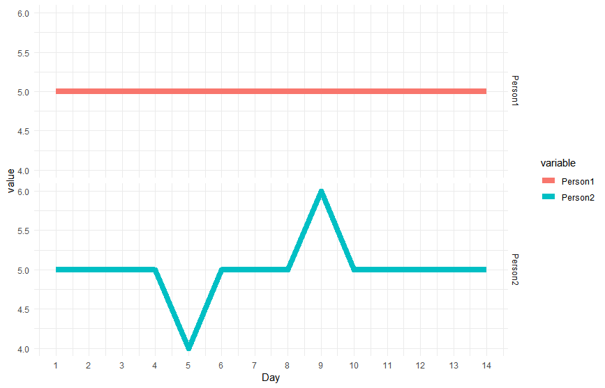

# Statement of Need

In today's digital world, data collection and storage costs are quite low. Humans are collectively outputting 2.5 quintillion bytes of data every day, and by 2020, each person will generate ~ 1.7 MB every second (https://www-01.ibm.com/common/ssi/cgi-bin/ssialias?htmlfid=WRL12345USEN).  At this scale, intensive longitudinal data about humans' behavior faciliates new discovery about the patterning of thought and action and potentially better prediction and optimization of health and well-being.

In raw, form the 2.5 quintillion bytes of raw data generated daily are difficult to interpret -- noisy time-series. Extraction of features from the time-series, however, allows reseasrchers to (1) reduce the dimensionality of their time-series data (e.g., reducing millions of time-stamped observations to, for example, summary feature vector of length 100); (2) summary characterizations of time-series data that may be used as predictors, correlates, or outcomes in study of between-person differences; and (3) improved and detialed description of human behavior streams (e.g., characterizing a behavioral time series in terms of its features; the mean is 'X', the range is 'Y', the peaks are at 'T12' and 'T30').  

Short data streams are easily summarized using basic features (e.g., mean, standard deviation, IQR). However, as the time-series get longer, numerous other features may be needed and/or can be accessed. Study of intraindividual variability has outlined the wide variety of time-series features that can be used to characterize between-person differences and within-person change - with features such as probability of acute change (PAC) or mean square of successive differences (MSSD) providing useful information about individuals' cognitive, emotional, and behavioral dynamics.   

# Summary

```package_name``` is an R package for time series feature extraction that is inspired and modeled after the Python package *tsFresh* (@tsfresh). The R language allows for an easy to use interface, with the underlying processing speed advantage of C languages (and flexibility to run on the web, with the help of R's Shiny).  The API for ```package_name``` is a wrapper for the highly-trafficked 'dplyr', mainly to lend on the flexibility of the grammar of data manipulation and shortcuts for non-standard evaluation. The API for ```package_name``` was designed to facilitate the extraction of features for any dataset in long format, including grouping of summaries by other factor. For example, if every person in your dataset has 1 observation each day for 8 days, and they do this in two bursts, once every 6 months, you can calculate features of the overall series, 16 observations from both bursts, or separately for each burst).  For convenience, the package can export extracted features in long format or wide format (i.e., wide format may be of interest when attempting to correlate same feature across several variables of interest).  By design, ```package_name``` is able to cope with missing data (in R, of class NA), a key deviation from tsfresh (https://github.com/blue-yonder/tsfresh/issues/90).  

```package_name``` is intended for use by researchers with time-series data, and will be of most interest to those developing their statistical and coding skills -- allowing them to extract many features from their time-series data with easy to use code and without need for high-level mathematics background.  The desire for feature extraction tools is widespread across all domains of data science, including, but not limited to, applications in: biological systems, finance, and psychology.

The current expectation is that over time, ```package_name```, will allow for two-levels of feature extraction from almost any data form (e.g., text, audio, images): (1) extracting time-series descriptive features from numerical data (already implemented); (2) extracting numerical features from non-numerical data (e.g., number of exclamation points in Twitter data; coming soon).

# Mentions of Ongoing Projects

```package_name``` is currently being used in analysis of experience sampling and multi-trial performance data in a variety of projects at the interface of data science and psychological science, including:

	- Intraindividual Study of Affect, Health, and Interpersonal Behavior (iSAHIB), https://quantdev.ssri.psu.edu/projects/isahib-intraindividual-study-affect-health-and-interpersonal-behavior
	- Midlife in the United States (MIDUS), National Study of Daily Experiences, http://midus.wisc.edu/midus2/project2
	- Einstein Aging Study (EAS), https://sliwinskilab.weebly.com/research-projects.html
	- Effects of Stress on Cognitive Aging, Physiology, and Emotion (ESCAPE), https://sliwinskilab.weebly.com/research-projects.html

# Figures

Figure depicts sample time series data from two participants, both with mean value of 5. You will notice, although they have identical means, the shape of the time series, and locations of peaks is different. ```package_name``` calculates features to better characterize differences such as these. 

# Acknowledgements

I thank Github user @blue-yonder, and other contributors, for creating tsfresh (https://github.com/blue-yonder/tsfresh) and inspiring ```package_name```. I would like to acknowledge and thank Github user @stas-g, for code on finding peaks (https://github.com/stas-g/findPeaks) and Dr. Nilam Ram for code on calculating probability of acute change.

I gratefully acknowledge contributions from Dr. Nilam Ram, Dr. Anthony Ong, Dr. Martin Sliwinski, and the Sliwinski lab throughout the early development process. Nelson A. Roque was supported by National Institute on Aging Grant T32 AG049676 to The Pennsylvania State University.

# References

https://cran.r-project.org/web/packages/features/features.pdf
https://github.com/mkearney/textfeatures
https://github.com/stas-g/findPeaks
https://github.com/nelsonroque/featuRe
https://dplyr.tidyverse.org/
https://github.com/blue-yonder/tsfresh/issues/90
https://github.com/blue-yonder/tsfresh

# JOSS Manuscript Checklist
In addition, your paper should include:

	-A list of the authors of the software and their affiliations
	-A summary describing the high-level functionality and purpose of the software for a diverse, non-specialist audience
	-A clear statement of need that illustrates the purpose of the software
	-A list of key references including a link to the software archive
	-Mentions (if applicable) of any ongoing research projects using the software or recent scholarly publications enabled by it
	- As this short list shows, JOSS papers are only permitted to contain a limited set of metadata (see header below), Statement of Need, Summary, and Reference sections. You can see an example accepted paper here. Given this paper format, a “full length” paper is not permitted, e.g., software documentation such as API (Application Programming Interface) functionality should not be in the paper and instead should be outlined in the software documentation.

# JOSS Submission Instructions

JOSS welcomes submissions from broadly diverse research areas. For this reason, we request that authors include in the paper some sentences that would explain the software functionality and domain of use to a non-specialist reader. Your submission should probably be somewhere between 250-1000 words. (https://joss.readthedocs.io/en/latest/submitting.html).